# Ethereum Foos - A Curated List Of Costly Ethereum Mistakes To Learn From

Status: Just commencing work on this. Enter a GitHub issue if you have further information to include into this report.

This is a list of costly mistakes that have occurred in the Ethereum ecosystem, and some suggestions on how to mitigate the risk of
this happening to you.

This page has not been created to attribute blame, as developers (myself include) build imperfect systems. This page has been created
to list some of the weak points in systems (including people and group processes) that will need to be protected with additional care.

The Ethereum and cryptocurrency field is experimental, and care should be taken to minimise your chances of losing funds.

If you have improvements to this list, please submit a GitHub issue.

 

## Table Of Contents

* [An Enigma](#an-enigma)
* [What Crowdsale?](#what-crowdsale)
* [Check Your Crowdsale Contract Parameters](#check-your-crowdsale-contract-parameters)
* [Hack With Unknown Vector](#hack-with-unknown-vector)
* [Even Commonly Used Software Can Have Costly Bugs](#even-commonly-used-software-can-have-costly-bugs)
* [Protect Your Crowdsale Website](#protect-your-crowdsale-website)
* [The Phishing Waves](#the-phishing-waves)
* [The Great DAO Hack](#the-great-dao-hack)
* [Dont Leave Your Ports Open](#dont-leave-your-ports-open)
* [Mismatch Of Private And Public Keys](#mismatch-of-private-and-public-keys)

 

## An Enigma

Aug 22 2017

User [/u/AEonCIpher](https://www.reddit.com/user/AEonCIpher) posted [Enigma ICO website hacked? address from enigma.co/presale already has 590+ etherum deposited. Also getting announcements of open presale access on slack channel and email](https://www.reddit.com/r/ethereum/comments/6v0upc/enigma_ico_website_hacked_address_from/).

User [/u/YYCExplorer](https://www.reddit.com/user/YYCExplorer) added that the following message was posted by the phishers:

> Hello All,
>
> We are pleased with the enormous support we have gotten in the last couple of weeks, The Enigma team has decided to open the Pre-Sale to the public. The hard cap for this pre sale will be 20 Million. Please note that tokens will be calculated and distributed based on how much the Pre-Sale raises.
>
> Ethereum address: 0x29D7d1dd5B6f9C864d9db560D72a247c178aE86B

And the address [0x29D7d1dd5B6f9C864d9db560D72a247c178aE86B](https://etherscan.io/address/0x29D7d1dd5B6f9C864d9db560D72a247c178aE86B)
shows that 1,492 ethers (4 lots of 373) were transferred out of this account.

<kbd>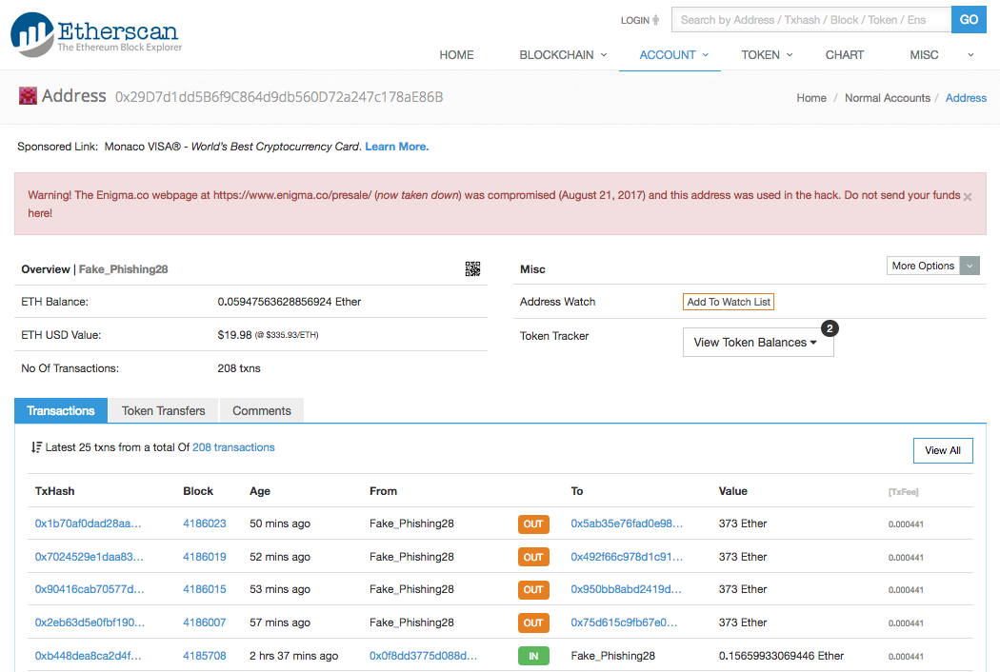</kbd>

According to [Here’s one way hackers can be stopped from stealing millions in an initial coin offering](http://www.businessinsider.sg/ethereum-price-ico-hack-2017-7/),
the cofounder and chief product officer of Enigma was quoted on the Coindash hack (see below):

> Hackers got into the backend of the site and changed the address...
>
> Thus, investors sent their money to the wrong Ethereum address.

Hmmm.

An then the scammers came back for more with the following message posted on slack (from [Enigma hackers have no shame](https://www.reddit.com/r/ethtrader/comments/6v949g/enigma_hackers_have_no_shame/)):

<kbd>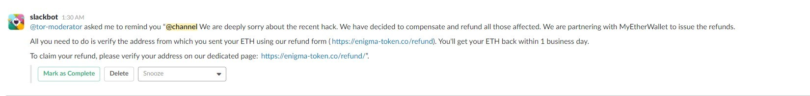</kbd>

Clicking on the link took me to:

<kbd>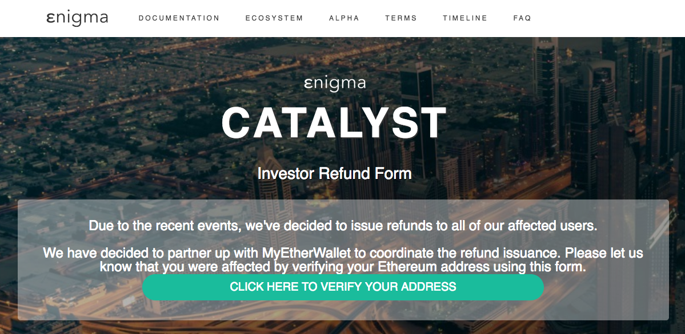</kbd>

Clicking on "CLICK HERE TO VERIFY YOUR ADDRESS" reveals a text box for users to enter their private keys:

<kbd>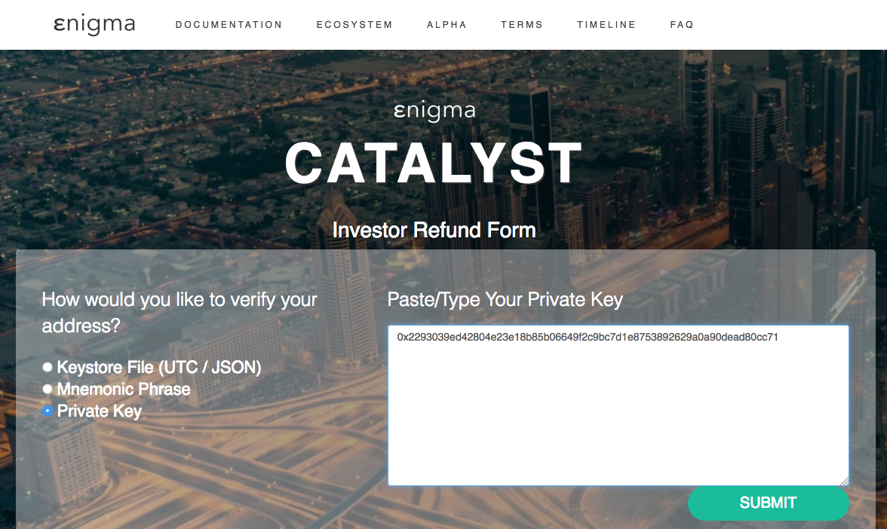</kbd>

 

### Losses

* 1,492 ethers ~ USD 500k @ 341.4710 ETH/USD

 

### How To Prevent This Happening To You

* Crowdsale investors, don't respond to unofficial messages. Be aware that even the official web site can be hacked as has happened
  twice in about 2 months.

 

### Further Information

* [Hackers nab $500,000 as Enigma is compromised weeks before its ICO](https://techcrunch.com/2017/08/21/hack-enigma-500000-ico/)
* [Hacker Nets over $500,000 after Hacking Enigma before ICO Date](https://www.cryptocoinsnews.com/hacker-nets-over-500000-after-hacking-enigma-before-its-ico-date/)

 

## What Crowdsale?

Aug 5 2017

User [/u/White_sama](https://www.reddit.com/user/White_sama) posted [Eros was (obviously) a scam. I sure hope nobody here invested](https://www.reddit.com/r/ethtrader/comments/6rlhs3/eros_was_obviously_a_scam_i_sure_hope_nobody_here/).

The link [https://eros.vision/](https://eros.vision/) now displays:

<kbd></kbd>

The link [https://icobazaar.com/eros](https://icobazaar.com/eros) show that the crowdsale raised 4,835,093.00 USD:

<kbd>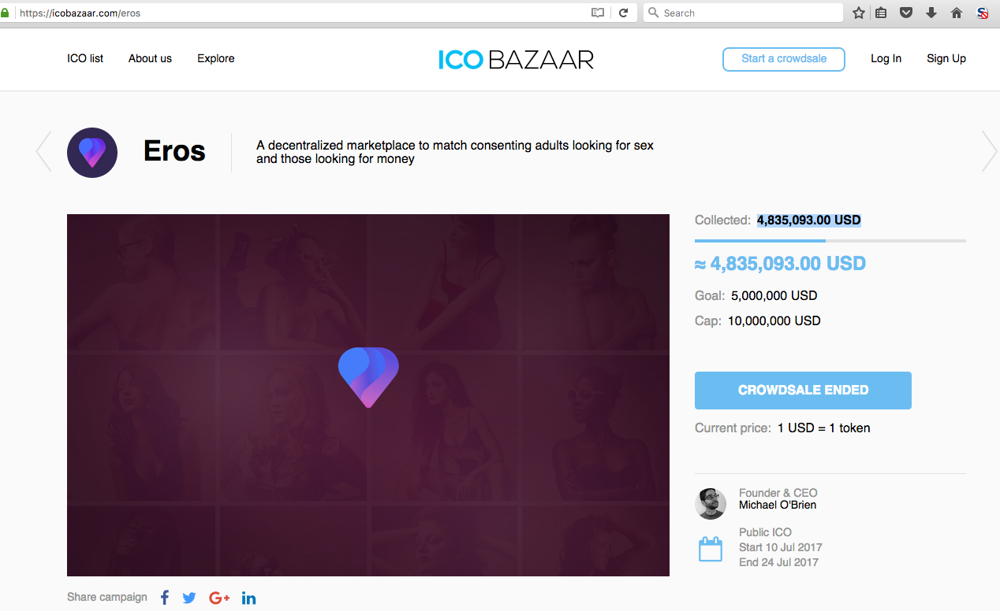</kbd>

There was a warning [Alert: EROS.vision ICO is a scam](https://www.reddit.com/r/ethtrader/comments/6l73xk/alert_erosvision_ico_is_a_scam/) posted on Jul 4 2017.

The whitepaper was apparently copied from [https://icobazaar.com/static/13fd64a514d4261422d424249b838172/464.pdf](https://icobazaar.com/static/13fd64a514d4261422d424249b838172/464.pdf),
but is now deleted:

<kbd>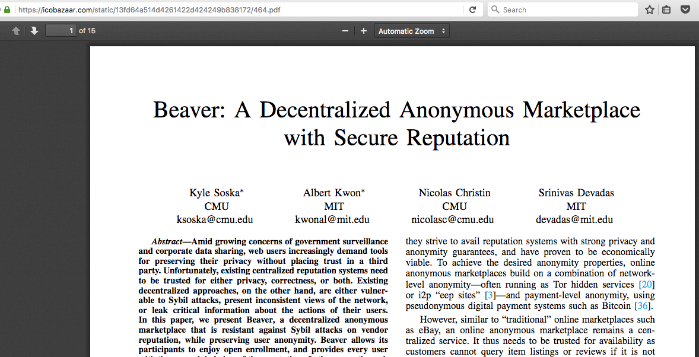</kbd>

One of the founders LinkedIn account [https://www.linkedin.com/in/michael-carter-o-brien-a32432146](https://www.linkedin.com/in/michael-carter-o-brien-a32432146), apparently:

<kbd></kbd>

One of the founders GitHub account [https://github.com/kairan0215](https://github.com/kairan0215) contains 3 forked projects, dated May 5 2017, and no further activity:

<kbd>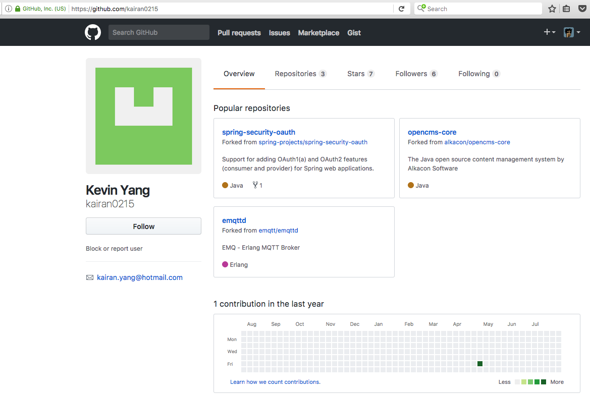</kbd>

And Eros placed a press release in Bitcoinist - [http://bitcoinist.com/eros-openbazaar-sex-backpage-ico/](http://bitcoinist.com/eros-openbazaar-sex-backpage-ico/):

<kbd>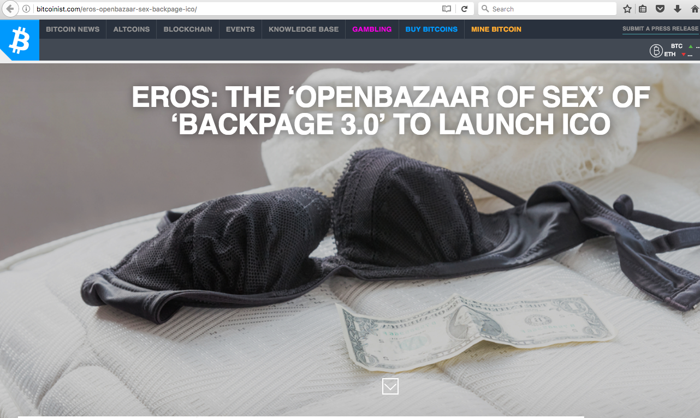</kbd>
<kbd>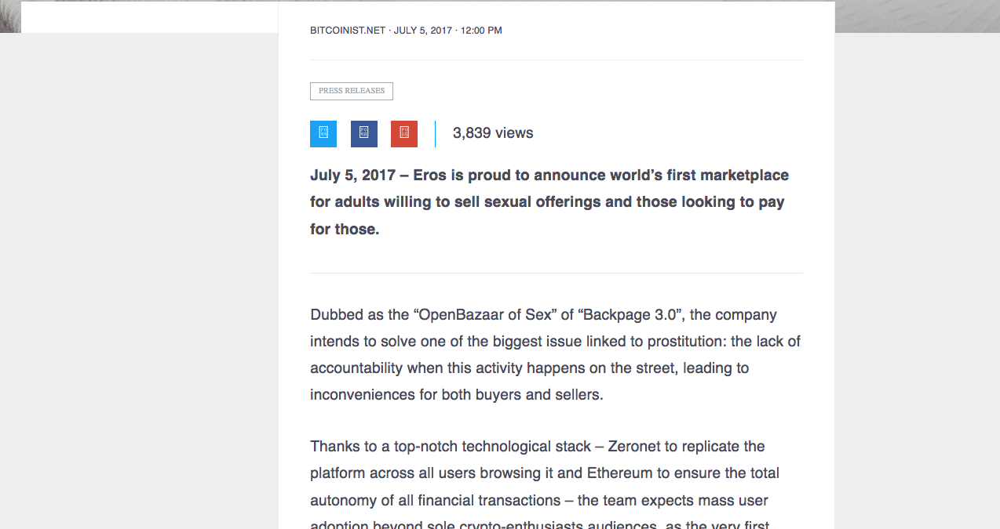</kbd>

 

### Losses

* 4,835,093.00 USD

 

### How To Prevent This Happening To You

{TODO}

 

### Further Information

* [Imminent ICO of Uber-like decentralized “SilkRoad of Sex” from Eros](https://coinidol.com/imminent-ico-of-silkroad-of-sex/)
* [How to announce an ICO soon after a related scam ICO launches?](https://www.reddit.com/r/ethtrader/comments/6lcefe/how_to_announce_an_ico_soon_after_a_related_scam/)
* Another crowdsale scam - Contingency
  * [Contingency Presale just went live! $140K USD raised so far](https://www.reddit.com/r/ethtrader/comments/5rbxo2/contingency_presale_just_went_live_140k_usd/)
  * [So what happened with the Contingency scammers?](https://www.reddit.com/r/ethtrader/comments/5uke1t/so_what_happened_with_the_contingency_scammers/)
  * [Contingency - With pre-sale launching in a little over 24 hours, let's meet the team](https://www.reddit.com/r/ethtrader/comments/5qymmy/contingency_with_presale_launching_in_a_little/)
    * [Contingency — Who are they?](https://medium.com/@ContingencyTech/contingency-who-are-they-77778ece54ff#.sz283oydd)

 

## Check Your Crowdsale Contract Parameters

Jul 31 2017

[REXMls](http://rexmls.com/)'s deployed their [RexToken](contracts/RexToken_DeployedAt_0x99d439455991f7f4885f20c634c9a31918d366e5.md) crowdsale contract to
[0x99d439455991f7f4885f20c634c9a31918d366e5](https://etherscan.io/address/0x99d439455991f7f4885f20c634c9a31918d366e5#code) with an incorrect
`vault` address.

Ethers contributions to the crowdsale contract were transferred to the incorrect `vault` address [0x03e4b00b607d0980668ca6e50201576b00000000](https://etherscan.io/address/0x03e4b00b607d0980668ca6e50201576b00000000),
instead of the correct `vault` address of [0x03e4b00b607d09811b0fa61cf636a6460861939f](https://etherscan.io/address/0x03e4b00b607d09811b0fa61cf636a6460861939f).

As no one has the private key to the incorrect address, the amount is forever locked in the incorrect address.

REXMls has since deployed a new crowdsale contract to [0xf05a9382a4c3f29e2784502754293d88b835109c](https://etherscan.io/address/0xf05a9382a4c3f29e2784502754293d88b835109c#code), this time sending the contributed funds
to the correct vault, and they will migrate the token balances into a new token contract at the end of the crowdsale.

 

### Losses

* [6,687.6257271739995 ETH](https://etherscan.io/address/0x03e4b00b607d0980668ca6e50201576b00000000#internaltx) (~ USD 1,480,573.46 @ 221.39 ETH/USD)

 

### How To Prevent This Happening To You

* Always triple check, and have separate individuals recheck, the parameters in your crowdsale contract before releasing the address to participants
* If possible, send a contribution transaction of your own and check that the ethers reach the destination account correctly
* If you are using crowdsale/token contracts that made up of a few separate contracts, it is safer to use a script to extract the parameters from each of the
  contracts and compare the values automatically
* Develop and test your crowdsale contract way before the crowdsale commences. Then give sufficient for your crowdsale contract code to
  be audited

 

### Further Information

* [Did REXmls ICO just lost 6600 ETH due to a copy&paste error?](https://www.reddit.com/r/ethtrader/comments/6qryc2/did_rexmls_ico_just_lost_6600_eth_due_to_a/)
* [The Solution](https://blog.rexmls.com/the-solution-a2eddbda1a5d)

 

## Hack With Unknown Vector

Jul 26 2017

[Veritaseum](http://veritas.veritaseum.com/) [founder claims USD 8 million in ICO tokens stolen](https://www.coindesk.com/veritaseum-founder-claims-8-million-ico-token-stolen/).
[Here](https://etherscan.io/address/0xac6491d061e933554222275f12a666e113b66ba2#tokentxns) is the account that received the stolen tokens.

 

### Losses

* USD 8 million

 

### How To Prevent This Happening To You

* Vector unknown, but the [hacked account](https://etherscan.io/address/0x82c48875c17ee5812f909a9d75c0f64f7a8719fe#tokentxns) is not a multisig account. This could perhaps have
  been avoided by using a hardware wallet like the [Ledger Nano S](https://www.ledgerwallet.com/products/ledger-nano-s) or the [Trezor](https://trezor.io/).

 

### Further Information

* [Search "Veritaseum hack"](https://www.google.com/search?q=Veritaseum+hack)

 

## Even Commonly Used Software Can Have Costly Bugs

Jun 18 2016

A hacker found a vulnerability in the Parity Multisig and stole ~ USD 32 million from 3 of these multisig wallets after exploiting this vulnerablity. The groups suffering losses from
this hack were [Edgeless](https://medium.com/@tomasdraksas/edgeless-response-to-parity-hack-3e35e20ba85c),
[Swarm City](https://press.swarm.city/follow-up-statement-from-the-swarm-city-core-team-3ab0f1274ad3) and
[æternity](https://blog.aeternity.com/parity-multisig-wallet-hack-47cc507d964d).

The White Hat Group checked the 500+ wallets suffering from the same vulnerability and exploited this vulnerability to secure ~ USD 208 million before returning all the funds back to
the original owners.

 

### Losses

* ~ USD 32 million

 

### How To Prevent This Happening To You

* Don't rely on software that is commonly used if you have to secure a large amount of funds. Check that you are using the correct version of the software, and this this software
  has been sufficiently checked, tested and audited

 

### Further Information

* [Parity Multisig Vulnerability - White Hat Group Rescue Reconciliation](https://github.com/bokkypoobah/ParityMultisigRecoveryReconciliation)
* [The WHG has Returned 100% of the Rescued Funds to their Rightful Owners](https://www.reddit.com/r/ethereum/comments/6qrjr5/the_whg_has_returned_100_of_the_rescued_funds_to/)
* [An In-Depth Look at the Parity Multisig Bug](http://hackingdistributed.com/2017/07/22/deep-dive-parity-bug/)
* [The Multi-sig Hack: A Postmortem](https://www.reddit.com/r/ethereum/comments/6ohadd/the_multisig_hack_a_postmortem/)

 

## Protect Your Crowdsale Website

Jun 18 2016

[CoinDash](https://coindash.io/) prepared their crowdsale smart contracts and published the address of the crowdsale contract address at the start of the crowdsale. A hacker replaced
the crowdsale contract address with their own address [0x6a164122d5cf7c840d26e829b46dcc4ed6c0ae48](https://etherscan.io/address/0x6a164122d5cf7c840d26e829b46dcc4ed6c0ae48) and over the
20 minutes before the hack was discovered, this address collected 43,488 ethers (~ USD 7 million).

 

### Losses

* 43,488 ethers (~ USD 7 million)

 

### How To Prevent This Happening To You

* Crowdsale Projects
  * Your website becomes a high value target when the crowdsale contract address is published on it and will need to be protected with extra care.
  * Protect your DNS registrar, your DNS entries
  * Monitor closely your website during the crowdsale period

 

### Further Information

* [Search "CoinDash hack"](https://www.google.com/search?q=CoinDash+hack)

 

## The Phishing Waves

May 2017

As crowdsales are becoming quite common in the Ethereum ecosystem, scammers keep inventing new ways to steal your cryptocurrency. Scammers will message you directly with URLs and
contract addresses. Do not click on these links. Only use links and addresses from trusted sources, and always double check.

 

#### Slackbot Phishing
Following is an example of an official-sounding Slackbot message offering some free tokens and providing a link to a phishing website with the URL myether**vv**alet DOT com (note the **vv** instead of **w**):

<kbd>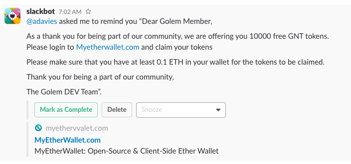</kbd>

Clicking on the link takes me to myether**vv**alet DOT com:
<kbd>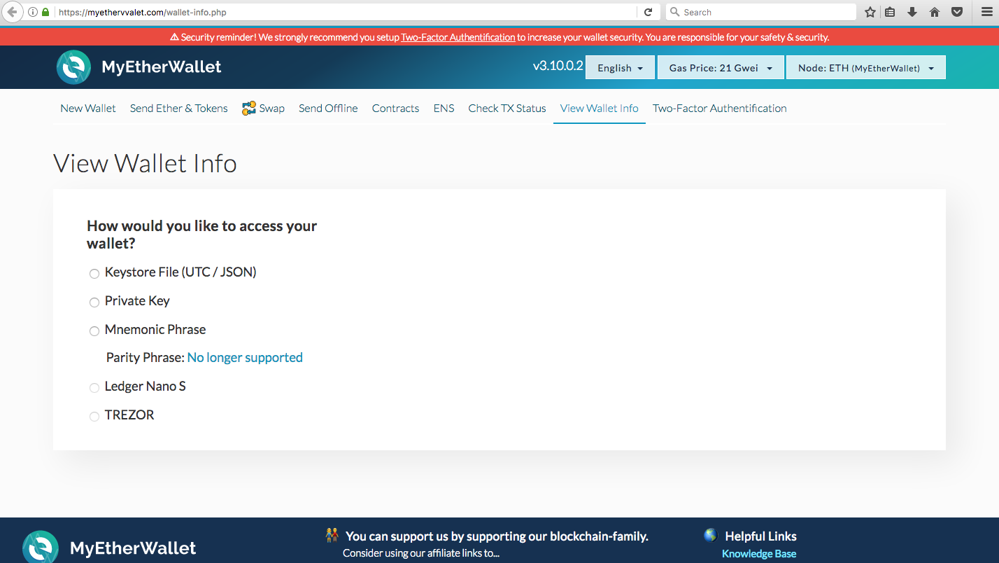</kbd>

Clicking on the green padlock next to the URL in the web browser shows me the web site information:
<kbd>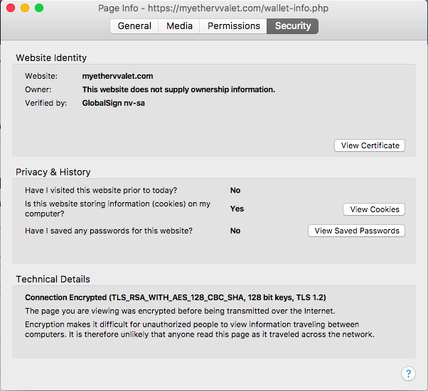</kbd>

The SSL certificate looks authentic enough (except for the spoofed domain name):
<kbd>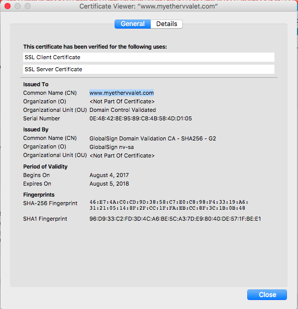</kbd>

I copied and pasted the domain name into [https://www.whois.com](https://www.whois.com) and this shows the website is registered to **Protection of Private Person** (which is a big warning sign):
<kbd>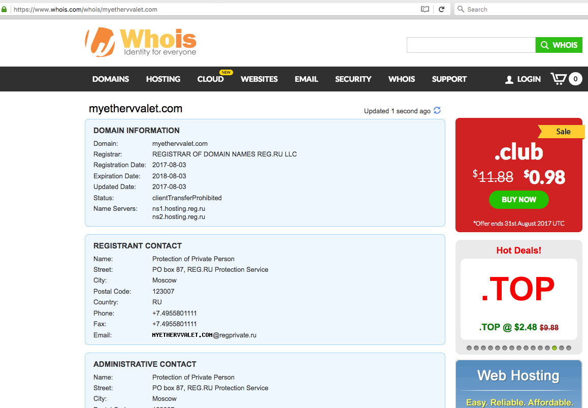</kbd>

A lot of cryptocurrency based crowdsale projects use Slacks and their administrators cannot stop these Slackbot messages from being
broadcast to all their users. Apparently it may not be a high priority for the company providing these Slack service to shut down these
Slackbot services as these cryptocurrency projects do not pay for the Slack services.

Some of these projects are moving into more secure forum services like [Discord](https://discordapp.com/).

 

#### A Phishing Account

Following is an account identified in EtherScan as a phisher's account [0x5b1a67c25ba691b251f39dde42bc7384e1c48814](https://etherscan.io/address/0x5b1a67c25ba691b251f39dde42bc7384e1c48814#tokentxns):

<kbd>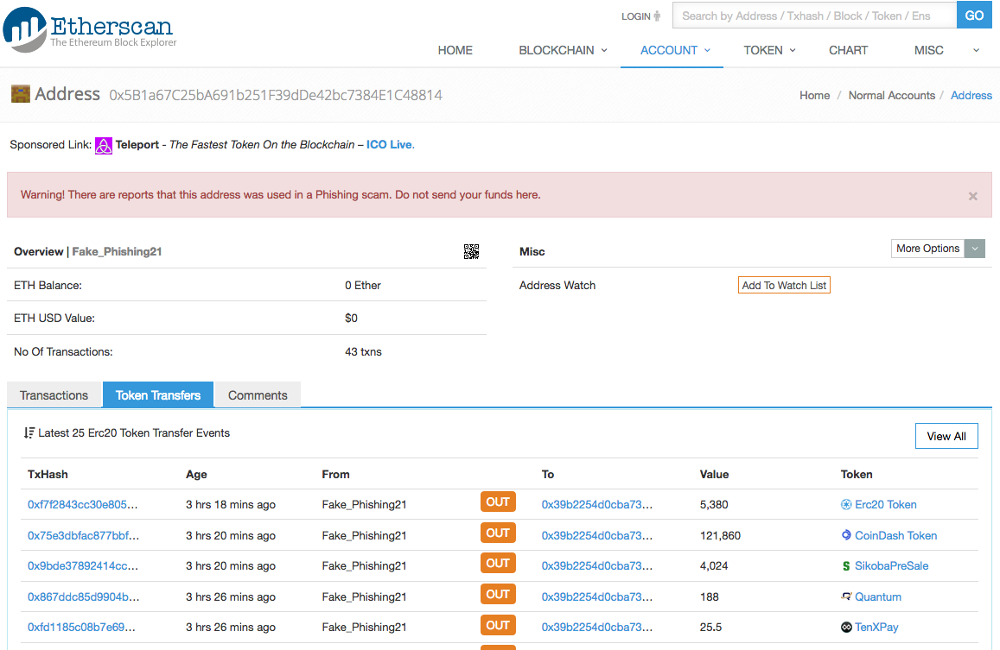</kbd>

Following the trail of transactions shows the transfers to [0x39b2254d0cba73fb65f34fa6ccd4dad6d4c16e65](https://etherscan.io/address/0x39b2254d0cba73fb65f34fa6ccd4dad6d4c16e65#tokentxns) and
this phisher has so far accummulated ~USD 50,000 in ethers and tokens:

<kbd>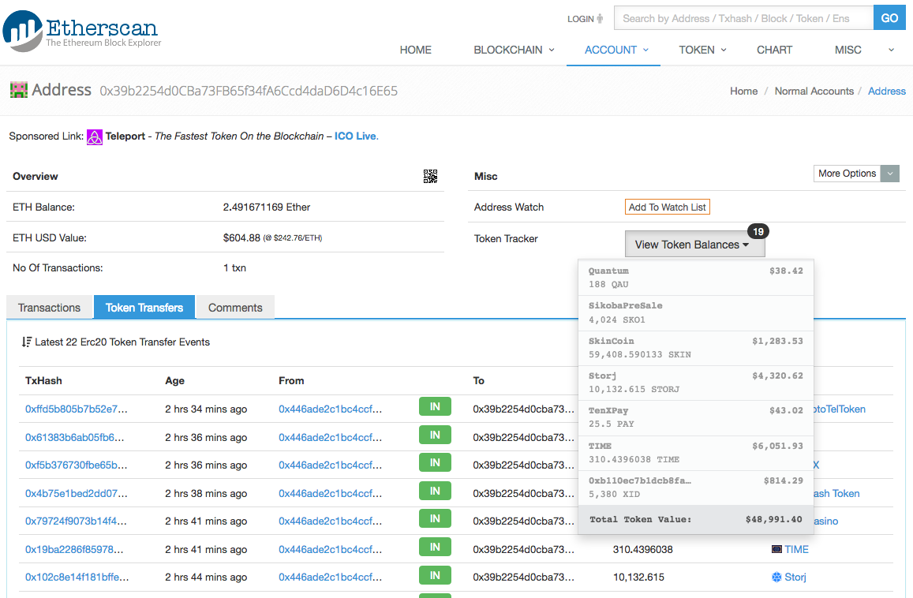</kbd>

 

### Losses

Unknown

 

### How To Prevent This Happening To You

* Cryptocurrency users
  * Do not blindly click on web links in messages (Slack, Slackbots, Twitter, Reddit, ...) or emails sent to you
  * Carefully verify websites you visit
  * Bookmark your verified website
  * Access your verified website through your saved bookmarks
  * Do NOT blindly rely on autocompleted websites - if you have accessed a spoofed website in the past, your autocompletion may retrieve the spoofed website from your browser history
  * You can hover over a link to check the exact naming of the link at the bottom left of your browser
  * Use a hardware wallet like the [Ledger Nano S](https://www.ledgerwallet.com/products/ledger-nano-s) or [Trezor](https://trezor.io/). These devices cost less than USD 100 and could save you a lot of losses.

* Slack based projects
  * Consider Discord or services that are more secure than Slack
  * Rename your **#general** channel to **#announcements**, and only allow the project administrators to post to this
    **#announcements** channel.
  * Inform your users that all official announcements will be broadcast in the **#announcement** channel, and tell them to ignore all
    other messages.

 

### Further Information

* [⚠ WARNING! Stop clicking links. Stop sending to addresses that were msg'd to you. Stop trusting slackbots. Stop trusting anyone on the fucking internet. Stop falling for scams.](https://www.reddit.com/r/ethereum/comments/6lfy73/warning_stop_clicking_links_stop_sending_to/)
* [Hacks, thefts, and stolen funds due to phishing links between 7/5/2017 - ??? (Slackbot Scambot phishing / Reddit DM / ???)](https://myetherwallet.groovehq.com/knowledge_base/topics/hacks-thefts-and-stolen-funds-due-to-phishing-links-between-7-slash-5-slash-2017-slackbot-scambot-phishing-slash-reddit-dm-slash?from_search=true)
* [EtherScamDb.info](https://etherscamdb.info/scams/)
* [Decentraland to reimburse victim after compromised official account scams investor out of 500 ETH](https://www.reddit.com/r/ethtrader/comments/6t7myf/decentraland_to_reimburse_victim_after/)

 

## The Great DAO Hack

Jun 18 2016

A bug in the smart contracts The DAO was built on had vulnerabilities leading to [the hack, the hard fork of the Ethereum blockchain and the return of funds to the original investors](https://www.cryptocompare.com/coins/guides/the-dao-the-hack-the-soft-fork-and-the-hard-fork/).

 

### Losses

* USD 70 million (at that time)

 

### How To Prevent This Happening To You

* Smart contracts are high value targets when they hold funds. Make sure that your smart contracts are well tested and audited. Keep your smart contracts simple so it is easy to
  verify the functionality
* See [The History of the DAO and Lessons Learned](https://blog.slock.it/the-history-of-the-dao-and-lessons-learned-d06740f8cfa5) and [search "The DAO hack lessons"](https://www.google.com/search?q=The+DAO+hack+lessons)

 

### Further Information

* [Search "The DAO hack"](https://www.google.com/search?q=The+DAO+hack)

 

## Dont Leave Your Ports Open

May 12 2016

Patrick, an Ethereum miner, opened up his Ethereum node RPC connect to the world. A script was polling his RPC connect for a chance to move this ethers. When Patrick
unlocked his account to execute a transaction, a [hacker made off with 7,218 ethers](https://ethereum.stackexchange.com/questions/3887/how-to-reduce-the-chances-of-your-ethereum-wallet-getting-hacked)
during the 3 second window that the account was unlocked.

 

### Losses

* 7,218 ethers (~ USD 1.62 million @ Aug 2 2017)

 

### How To Prevent This Happening To You

* If you open up your Ethereum client ports to the Internet in a non-standard way, make sure you know what you are doing and take measures to protect it.

 

### Further Information

* [Search "7218 ethers"](https://www.google.com/search?q=7218+ethers)

 

## Mismatch Of Private And Public Keys

Feb 8 2016

I was using the [ethaddress.org](https://github.com/ryepdx/ethaddress.org) software to generate a bulk list of paper wallets. I
produced 80+ pairs of private and public keys.

Being paranoid, I tested each generated pair by importing the private key into `geth` using the command
`geth account import {privatekeyfile}` and I found some of the generated public keys did not match.

So I created my first ever open source issue [#19 Invalid public key / private key generated](https://github.com/ryepdx/ethaddress.org/issues/19).

It turned out that a downstream library used by ethaddress.org had a bug that generated incorrect private and public key pairs -
[ #14 Update ethereumjs-tx dependency](https://github.com/SilentCicero/ethereumjs-accounts/pull/14).

 

### Losses

* 121 ETH - [Trying to recover my 121 ETH from 2015 js bug](https://www.reddit.com/r/ethereum/comments/6chqyk/trying_to_recover_my_121_eth_from_2015_js_bug/)

 

### How To Prevent This Happening To You

* Always test your new accounts before sending substantial amounts to your account
  * Test by unlocking your private key in another client and check the public key
  * Test by sending a small amount of ethers to your new account, then sending back the ethers to the originating account

 

### Further Information

* [PSA: Check your EthAddress.org wallets (and any other wallet generated using ethereumjs-accounts)](https://www.reddit.com/r/ethereum/comments/47nkoi/psa_check_your_ethaddressorg_wallets_and_any/)

 

 

(c) BokkyPooBah / Bok Consulting Pty Ltd - Aug 2 2017. The MIT Licence.